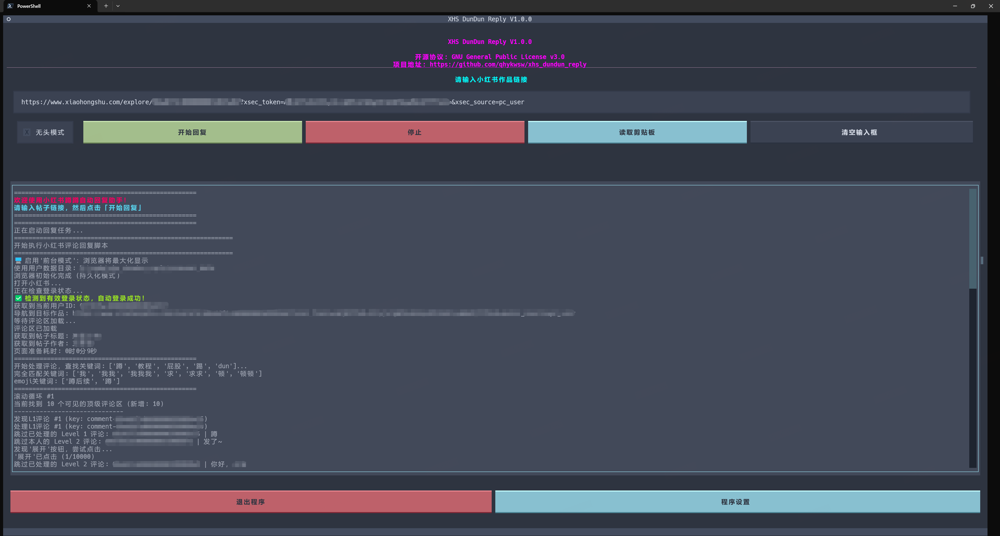
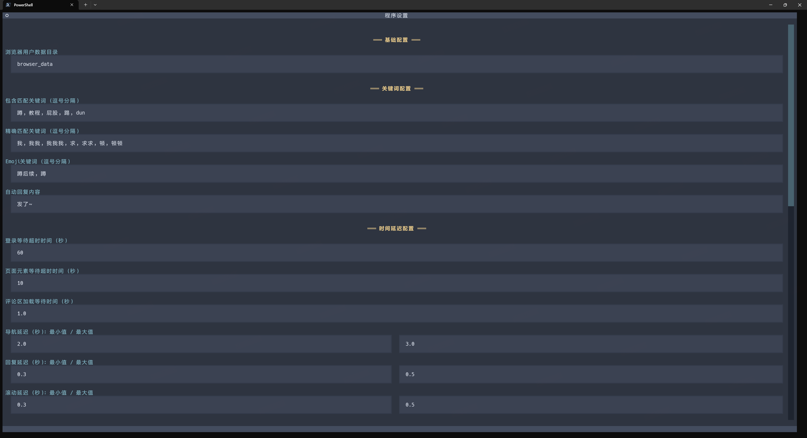

# 小红书蹲蹲自动回复助手 (XHS DunDun Reply Bot)


这是一个基于 Python 和 Playwright 开发的小红书自动评论回复工具。它可以遍历指定帖子的评论区，根据预设的关键词（包括文本和 Emoji 表情）自动进行回复。

**🎉 支持 TUI 图形界面！** 无需手动修改代码配置，小白也能轻松使用。

本项目旨在帮助博主或运营人员更高效地与粉丝互动，特别是针对 "蹲后续"、"求教程" 等常见评论进行自动化响应。

## ✨ 主要功能

*   **TUI 图形界面**：
    *   友好的终端图形界面，无需修改代码。
    *   实时日志显示，直观查看运行状态。
    *   可视化配置管理，所有参数一目了然。
    *   支持剪贴板读取和快速清空输入框。
*   **关键词匹配**：
    *   **精确匹配**：只有评论内容完全一致才触发（如 "我"）。
    *   **包含匹配**：只要评论中包含关键词就触发（如 "蹲"、"教程"）。
    *   **Emoji 匹配**：支持识别并匹配特定的 Emoji 表情含义（如 蹲 的表情）。
*   **多级评论支持**：
    *   能够遍历并回复一级评论（L1）及其下属的二级评论（L2）。
    *   支持自动点击 "展开" 按钮获取更多回复。
*   **持久化登录**：保存浏览器用户数据，扫码一次后即可自动免登。
*   **防风控机制**：
    *   内置简单的风控检测机制（检测 "操作过于频繁"、输入框禁用等信号）。
    *   触发风控时自动暂停并尝试重启脚本。
    *   支持配置最大重启次数和延迟时间。
*   **断点续传**：
    *   已回复记录会保存在 `reply_data/` 目录下，文件名为 `帖子ID.jsonl`，防止重复回复。
    *   支持从指定的位置（第 N 个评论或指定 Comment ID）开始处理，避免重复工作。
*   **灵活配置**：所有参数均可通过图形界面或 `settings.json` 配置文件管理。

## 🪟 关于终端

⭐ 推荐使用 [Windows 终端](https://learn.microsoft.com/zh-cn/windows/terminal/install) （Windows 11 默认终端）运行程序以便获得最佳显示效果！

## 🥣 使用方法

如果仅需快速使用本工具，建议选择 **程序运行**；如果需要进行二次开发或自定义修改，建议选择 **源码运行**！

### 🖱 程序运行

#### 1. 下载程序

⭐ Windows 10 及以上用户可前往 [Releases](https://github.com/qhykwsw/xhs_dundun_reply/releases/latest) 下载程序压缩包，解压后打开程序文件夹，双击运行 `XHS-DunDun-Reply.exe` 即可使用。程序会启动一个 **TUI 图形界面**，你可以：
1. 在输入框中粘贴小红书帖子链接（或点击"读取剪贴板"自动填充）
2. 勾选"无头模式"（可选，勾选后浏览器在后台运行）
3. 点击"开始回复"按钮
4. 在日志区域实时查看运行状态



#### 2. 修改配置

点击界面底部的"程序设置"按钮，可以修改：
*   关键词列表（包含匹配、精确匹配、Emoji匹配）
*   回复内容
*   各种延迟时间
*   风控相关配置
*   断点续传配置



#### 3. 首次登录

首次运行时，程序会自动打开 Chromium 浏览器。请在 **60秒内** 使用小红书 App 扫码登录。
登录成功后，程序会自动保存 Session 到 `browser_data` 目录，下次运行时无需再次扫码。

### ⌨️ 源码运行

#### 环境依赖

*   Python 3.10 或更高版本
*   Playwright
*   Textual (TUI 框架)
*   pyperclip (剪贴板支持)

#### 安装步骤

##### 1. 克隆项目

```bash
git clone https://github.com/qhykwsw/xhs_dundun_reply.git
cd xhs_dundun_reply
```

##### 2. 安装依赖

```bash
pip install -r requirements.txt
playwright install chromium
```

##### 3. 运行程序

```bash
python main.py
```

## 📁 目录结构

```text
xhs_dundun_reply/
├── main.py                 # 主程序入口 (TUI 界面)
├── requirements.txt        # 项目依赖
├── settings.json           # [自动生成] 配置文件
├── source/                 # 源代码目录
│   ├── application/        # 核心业务逻辑
│   │   └── app.py          # 评论回复主逻辑
│   ├── TUI/                # TUI 图形界面
│   │   ├── app.py          # TUI 应用主入口
│   │   ├── index.py        # 首页界面
│   │   └── setting.py      # 设置界面
│   ├── expansion/          # 扩展模块
│   │   ├── emoji.py        # Emoji 提取器
│   │   └── emoji.json      # Emoji 映射数据
│   └── module/             # 公共模块
│       ├── settings.py     # 配置管理
│       └── static.py       # 静态常量
├── static/                 # 静态资源
│   └── xhs-dundun-reply.tcss  # TUI 样式表
├── browser_data/           # [自动生成] 浏览器缓存与登录信息
├── reply_data/             # [自动生成] 已处理的评论记录
└── logs/                   # [自动生成] 运行日志
```

## ⚠️ 注意事项与常见问题

1.  **关于风控**：小红书对自动化操作有严格的风控。本工具已内置了随机延迟和伪无头模式，但不能保证 100% 不被检测。请务必合理设置回复频率。
2.  **数据隐私**：`browser_data` 文件夹包含你的登录 Cookie，**请勿** 将其上传到 GitHub 或分享给他人。`.gitignore` 默认已忽略此文件夹。
3.  **运行模式**：
    *   **调试建议**：设置 `headless = False`，你可以看到浏览器的操作过程，确保逻辑符合预期，该模式下依然可以切换到其他应用。
    *   **长期运行**：设置 `headless = True`，浏览器窗口会移至屏幕外运行（坐标 10000,10000），不会干扰你的正常工作。

## ⚖️ 免责声明

*   本工具仅供学习和技术研究使用。
*   严禁使用本工具进行垃圾信息轰炸、骚扰他人或违反小红书平台规则的行为。
*   使用本工具产生的任何账号风险（如禁言、封号）由使用者自行承担，开发者不承担任何责任。

## 📜 开源协议

本项目基于 [GNU General Public License v3.0](LICENSE) 开源。

### 🙏 致谢

本项目在开发过程中参考了 [XHS-Downloader](https://github.com/JoeanAmier/XHS-Downloader) 的 TUI 界面设计理念和项目架构，特此致谢！

## 🧸 额外说明
1. 感谢 star ⭐ 和 follow 📰！
2. 感谢赞助！如果此项目对您有帮助，请作者喝一杯奶茶~~ （开心一整天 😊😊）
3. Thank you~~

<div align="center">
   
  
</div>


## 📈 Star 趋势
<a href="https://www.star-history.com/#cv-cat/xhs_dundun_reply&Date">
 <picture>
   <source media="(prefers-color-scheme: dark)" srcset="https://api.star-history.com/svg?repos=cv-cat/xhs_dundun_reply&type=Date&theme=dark" />
   <source media="(prefers-color-scheme: light)" srcset="https://api.star-history.com/svg?repos=cv-cat/xhs_dundun_reply&type=Date" />
   
 </picture>
</a>
